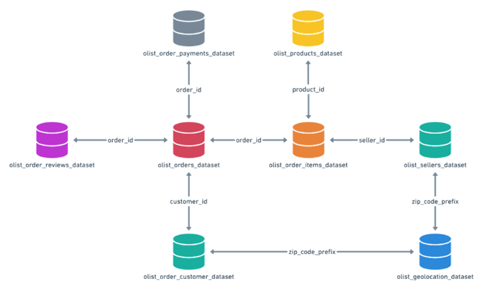

# Timelytics

## Optimize your supply chain with advanced forecasting techniques.

Timelytics is an ensemble model that utilizes three powerful machine learning algorithms - XGBoost, Random Forests, and Support Vector Machines (SVM) - to accurately forecast Order to Delivery (OTD) times. By combining the strengths of these three algorithms, Timelytics provides a robust and reliable prediction of OTD times, helping businesses to optimize their supply chain operations.

With Timelytics, businesses can identify potential bottlenecks and delays in their supply chain and take proactive measures to address them, reducing lead times and improving delivery times. The model utilizes historical data on order processing times, production lead times, shipping times, and other relevant variables to generate accurate forecasts of OTD times. These forecasts can be used to optimize inventory management, improve customer service, and increase overall efficiency in the supply chain.


## Dataset

[Brazilian E-Commerce Public Dataset by Olist](https://www.kaggle.com/datasets/olistbr/brazilian-ecommerce)

"brazilian-ecommerce.zip" will get downloaded in the current data folder.

In the data folder execute the following commands to unzip:

```
sudo apt-get install unzip
unzip brazilian-ecommerce.zip
```


Source - 
The dataset consists of real-world delivery details sourced from a Brazilian E-commerce Company which was scrubbed and anonymized.

It consists of multiple tables which include relevant information about the customer, seller, order, location etc. The individual tables are interconnected as shown in the following schema. Relevant features will be extracted/designed from this data and then be used to train our supervised ML model.




## ⭐  To run these scripts, you need the following installed:

1. Python 3
2. The python libraries listed in requirements.txt
    * Try running "pip3 install -r requirements.txt"

### Step 1: Clone this repository
Run:
```bash
git clone https://github.com/SaiJeevanPuchakayala/Timelytics
```

### Step 2: Navigate to the Timelytics directory
Run:
```bash
cd BinSpy
```
### Step 3: Install the python libraries
Run:
```bash
pip install -r requirements.txt
```
### Step 4: Run the streamlitApp.py file
Run:
```bash
streamlit run streamlitApp.py
```

## ⭐ Streamlit Deployment Configurations:
```
[theme]
base="dark"

[browser]
gatherUsageStats = false
```

## ⭐ References:
1. https://30days.streamlit.app/
2. https://docs.streamlit.io/streamlit-community-cloud/get-started/deploy-an-app
3. https://streamlit-cloud-example-apps-streamlit-app-sw3u0r.streamlit.app/?hsCtaTracking=28f10086-a3a5-4ea8-9403-f3d52bf26184|22470002-acb1-4d93-8286-00ee4f8a46fb
4. https://docs.streamlit.io/library/advanced-features/configuration

